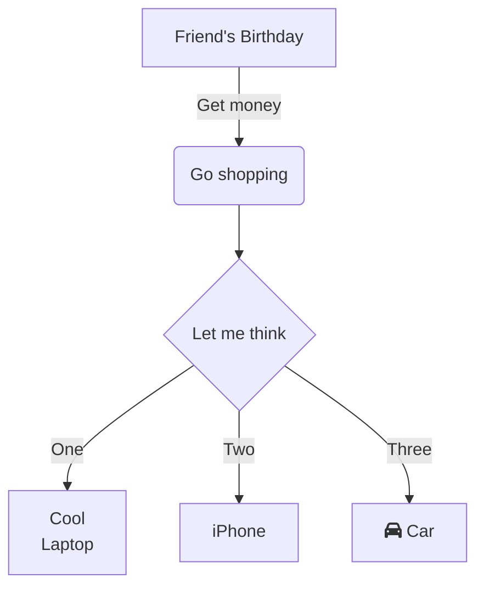

<!-- 1. INSERTNG A IMAGE -->
<!-- <picture>
 <source media="(prefers-color-scheme: dark)" srcset="YOUR-DARKMODE-IMAGE">
 <source media="(prefers-color-scheme: light)" srcset="YOUR-LIGHTMODE-IMAGE">
 
</picture> -->
<!-- <picture>
  <source media="(prefers-color-scheme: dark)" srcset="https://user-images.githubusercontent.com/25423296/163456776-7f95b81a-f1ed-45f7-b7ab-8fa810d529fa.png">
  <source media="(prefers-color-scheme: light)" srcset="https://user-images.githubusercontent.com/25423296/163456779-a8556205-d0a5-45e2-ac17-42d089e3c3f8.png">
  
</picture> -->

## ABOUT ME

testing on README.md 

| Rank | THING-TO-RANK |
|-----:|---------------|
|     1|  Jenkins      |
|     2|  JAVA         |
|     3|  C++          |

<details>
<summary>Data Structure</summary>

| No | TITLE              |
|---:|-------------------:|
|   1| Linked List        |
|   2| Double Linked List |

</details>

---
> If we pull together and commit ourselves, then we can push through anything.

— Mona the Octocat

# A first-level heading
## A second-level heading
### A third-level heading

**This is bold text**
*This text is italicized*
~~This was mistaken text~~
**This text is _extremely_ important**
***All this text is important***
<sub>This is a subscript text</sub>
<sup>This is a superscript text</sup>

Use `git status` to list all new or modified files that haven't yet been committed.

Some basic Git commands are:
```
git status
git add
git commit
```

The background color is `#ffffff` for light mode and `#000000` for dark mode.

This site was built using [GitHub Pages](https://pages.github.com/).

[Contribution guidelines for this project](docs/CONTRIBUTING.md)

<!--  -->

- George Washington
* John Adams
+ Thomas Jefferson

1. James Madison
2. James Monroe
3. John Quincy Adams


1. First list item
   - First nested list item
     - Second nested list item

1.   First list item
     - First nested list item

Here is a simple footnote[^1].

A footnote can also have multiple lines[^2].

[^1]: My reference.
[^2]: To add line breaks within a footnote, prefix new lines with 2 spaces.
  This is a second line.
  
| Command | Description |
| --- | --- |
| git status | List all new or modified files |
| git diff | Show file differences that haven't been staged |

| Command | Description |
| --- | --- |
| `git status` | List all *new or modified* files |
| `git diff` | Show file differences that **haven't been** staged |


| Left-aligned | Center-aligned | Right-aligned |
| :---         |     :---:      |          ---: |
| git status   | git status     | git status    |
| git diff     | git diff       | git diff      |

| Name     | Character |
| ---      | ---       |
| Backtick | `         |
| Pipe     | \|        |

<details>

<summary>Tips for collapsed sections</summary>

### You can add a header

You can add text within a collapsed section. 

You can add an image or a code block, too.

```ruby
   puts "Hello World"
```

</details>

```
function test() {
  console.log("notice the blank line before this function?");
}
```

```ruby
require 'redcarpet'
markdown = Redcarpet.new("Hello World!")
puts markdown.to_html
```

Here is a simple flow chart:


<!-- 
```stl
solid cube_corner
  facet normal 0.0 -1.0 0.0
    outer loop
      vertex 0.0 0.0 0.0
      vertex 1.0 0.0 0.0
      vertex 0.0 0.0 1.0
    endloop
  endfacet
  facet normal 0.0 0.0 -1.0
    outer loop
      vertex 0.0 0.0 0.0
      vertex 0.0 1.0 0.0
      vertex 1.0 0.0 0.0
    endloop
  endfacet
  facet normal -1.0 0.0 0.0
    outer loop
      vertex 0.0 0.0 0.0
      vertex 0.0 0.0 1.0
      vertex 0.0 1.0 0.0
    endloop
  endfacet
  facet normal 0.577 0.577 0.577
    outer loop
      vertex 1.0 0.0 0.0
      vertex 0.0 1.0 0.0
      vertex 0.0 0.0 1.0
    endloop
  endfacet
endsolid
``` -->

